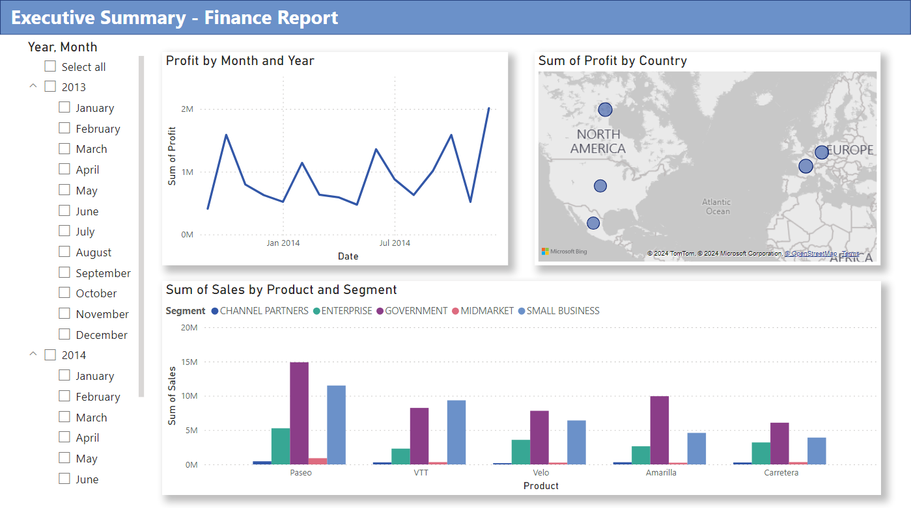

Tutorial here: https://learn.microsoft.com/en-us/power-bi/create-reports/desktop-excel-stunning-report

Goal:
Given a [sample Excel workbook](https://go.microsoft.com/fwlink/?LinkID=521962), Your manager wants to see a report on your latest sales figures. They've requested an executive summary of:
<ul>
    <li>Which month and year had the most profit?</li>
    <li>Where is the company seeing the most success (by country/region)?</li>
    <li>Which product and segment should the company continue to invest in?</li>
</ul>

This is my first experience with Power BI. Here are my achievements:
<ul>
    <li>Transformed Data</li>
        <li>Used the "transform data" option while importing to exclude products, round to whole numbers, and make titles uppercas.e</li>
        <li>Learned that Power BI can detect field types (Sigma symbol for numbers, clendar symbol for dates).</li>
        <li>Used DAX language to write simple expressions that created new tables (represented by a calculator).</li>
    <li>Learned the differences in views</li>
        <li>Model View allows me to manipulate data</li>
        <li>Model View allows me to create relationships between tables (reational schema)</li>
    <li>Learned to create visuals</li>
        <li>How to create charts by dragging a table onto the canvas, then dragging another onto that one to combine them.</li>
        <li>Learned Date Hierarchy field vs Date field</li>
    <li>Slicers</li>
</ul>

What the tutorial outcome looked like:

My alterations to it:

QR code to access the workspace:
